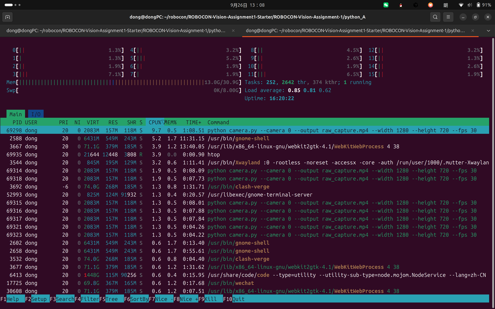

# Assignment 1

## 1. System Information

```text
Ubuntu:        Ubuntu 24.04.4 LTS (noble)
Kernel:        7.0.0-31-generic
CPU:           Intel(R) Core(TM) Ultra 7 356H
               x86_64，16 核，每核 1 线程，1 座
GPU:           Intel Corporation [8086:b0a0]
               Subsystem: Lenovo [17aa:80cf]
GPU 驱动:      xe（Kernel modules: xe）
图形会话:      wayland
NVIDIA Driver: N/A
CUDA Toolkit:  N/A
```

`lspci` 只看到这一块 Intel 核显，没有 NVIDIA GPU，因此 NVIDIA Driver 与 CUDA Toolkit 记为 N/A。

## 2. Python Project A

工作目录：`ROBOCON-Vision-Assignment-1/python_A`。Conda 环境名 `robocon-a`，未修改 `pyproject.toml` 的 `requires-python`。

```bash
cd ~/robocon/ROBOCON-Vision-Assignment1-Starter/ROBOCON-Vision-Assignment-1/python_A
conda create -n robocon-a python=3.10 -y
conda activate robocon-a
python --version
which python
pip install -r requirements.txt
```

环境创建成功，位置为 `/home/dong/miniforge3/envs/robocon-a`，安装的是 `python-3.10.21`。

```text
Python 3.10.21
/home/dong/miniforge3/envs/robocon-a/bin/python
```

依赖安装成功：

```text
Successfully installed numpy-1.26.4 opencv-python-4.11.0.86
```

再次执行 `pip install -r requirements.txt` 时，这两个包均已满足要求。

在 `(robocon-a)` 中运行：

```bash
python camera.py --camera 0 --output raw_capture.mp4 --width 1280 --height 720 --fps 30
```

程序打印并在退出时记录：

```text
PID:          69298
PPID:         60414
Python:       /home/dong/miniforge3/envs/robocon-a/bin/python
Python ver.:  3.10.21
Actual stream: 640x480, writer FPS=30.00
Saved raw video: .../python_A/raw_capture.mp4
Captured frames: 6341
Elapsed time:    372.7 s
Loop rate:       17.0 frame/s
```

连续运行 372.7 秒，超过 30 秒。原始视频为 `python_A/raw_capture.mp4`（mpeg4 Simple Profile，640×480，时长 3 分 31 秒）。退出方式是 `Ctrl+C`。

运行中的三个窗口：


## 3. Process Observation

`camera.py` 启动时打印 `PID: 69298`、`PPID: 60414`。另开一个终端，先按命令名找到进程，再用 `ps` 取出各项，并和打印的 PID 核对：

```bash
pgrep -af camera.py
ps -o pid,ppid,pcpu,pmem,etime,cmd -p 69298
pstree -sp 69298
htop
```

`pgrep -af` 按完整命令行匹配 `camera.py`。下一条用这个 PID 取出父进程、CPU、内存、已运行时间和命令。`pstree -sp` 查看它和父进程的关系。

与程序打印一致的结果：

```text
PID:     69298
PPID:    60414
CMD:     python camera.py --camera 0 --output raw_capture.mp4 --width 1280 --height 720 --fps 30
CPU %:   9.7
MEM %:   1.5
ELAPSED: 372.7 s
```

CPU % 和 MEM % 是运行期间 `htop` 里该 PID 的读数。`ELAPSED` 是程序退出时打印的墙钟时间。`htop` 的 `TIME+`（1:08.51）是 CPU 时间，不是这段墙钟时间。

`htop` 里同一条命令还有多个线程（例如 69314、69318、69316、69317、69321、69323）。屏幕上方能看到整机 CPU 条、内存 `13.0G/30.9G`、任务 `252`、线程 `2642`。



## 4. Python Project B

工作目录：`ROBOCON-Vision-Assignment-1/python_B`。未修改 `pyproject.toml` 的 `requires-python`。

```bash
conda create -n robocon-b python=3.12 -y
conda activate robocon-b
python --version
which python
pip install -r requirements.txt
```

```text
Python 3.12.14
/home/dong/miniforge3/envs/robocon-b/bin/python
Successfully installed imageio-2.37.4 imageio-ffmpeg-0.6.0 numpy-2.5.3 scikit-image-0.26.0
```

在 `python_B` 目录读取 Project A 的原始视频：

```bash
python analyze_video.py \
  --input ../python_A/raw_capture.mp4 \
  --output advanced_analysis.mp4
```

输出文件为 `python_B/advanced_analysis.mp4`。编码是 H.264，分辨率 1920×480（三幅画面并排），时长 3 分 31 秒，与输入视频一致。

```text
Project A 使用的 Conda 环境：robocon-a
Python 版本：3.10.21
Project B 使用的 Conda 环境：robocon-b
Python 版本：3.12.14
为什么不能直接把两个项目当成同一个环境来完成：
Project A 要求 Python >=3.9,<3.11、NumPy >=1.26,<2.0；
Project B 要求 Python >=3.12,<3.14、NumPy >=2.0,<3.0。
Python 与 NumPy 的版本范围都没有交集，同一个环境无法同时满足两份 pyproject.toml，因此要分成 robocon-a 和 robocon-b 两个 Conda 环境。
从更广泛的意义上说，一个 Conda 环境只固定一套 Python 和库版本。两个项目要的版本互相排斥时，就各自使用一个环境，这样安装或升级其中一个项目，不会替换另一个项目已经装好的包。
```

## 5. C++ Manual Build

在 `cpp` 目录执行并成功：

```bash
g++ -std=c++17 \
  -Iinclude \
  -I/usr/include/eigen3 \
  src/main.cpp src/transform.cpp \
  $(pkg-config --cflags --libs opencv4) \
  -o cpp_task
```

`-I` 的作用是什么？

`-I` 给编译器增加一个查找头文件的目录。`-Iinclude` 用来找到 `#include "transform.hpp"`。`-I/usr/include/eigen3` 用来找到 `#include <Eigen/Dense>`。

为什么 `transform.hpp` 不单独作为一个 cpp 文件编译？

`transform.hpp` 只有结构体和函数声明，没有函数的实现。它被 `main.cpp` 和 `transform.cpp` 用 `#include` 读进去，告诉编译器这些函数长什么样。真正的函数体在 `transform.cpp` 里，所以只编译带实现的 `.cpp` 文件。

为什么只写 `main.cpp` 往往无法得到完整程序？

`main.cpp` 调用了 `transformFrame` 和 `composePreview`，这两个函数的实现在 `transform.cpp`。只编译 `main.cpp` 时，链接阶段找不到这两个函数的实体，程序不完整。

编译成功后产生的文件是什么？

当前目录下的可执行文件 `cpp/cpp_task`。

## 6. CMake Build

手工 `g++` 成功后再编写 `cpp/CMakeLists.txt`。这里放入：

```text
CMakeLists.txt 的完整内容
cmake configure 命令
cmake build 命令
可执行文件运行命令
运行结果
手工 g++ 命令和 CMake 的关系是什么？
```

## 7. Git / GitHub

记录实际执行过的 `git status`、`git add`、`git commit`、`git branch`、`git switch`、`git push`、`git log --oneline --graph --all`。

## 8. Problems and Notes

记录部署和运行中遇到的问题与处理方式。
